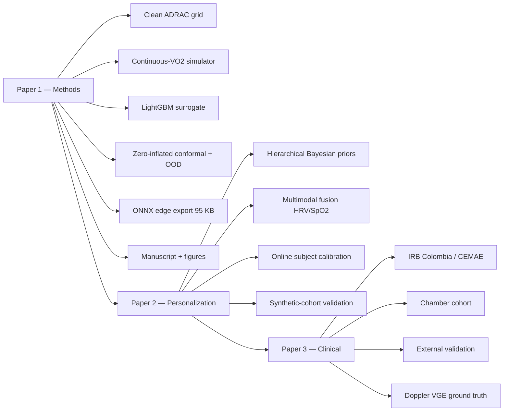

<div align="center">

# TinyDCS

**A wearable-grade machine-learning stack for altitude-decompression-sickness risk prediction.**

*Hybrid physics + ML. Calibrated uncertainty. Edge-deployable. Operationally honest.*

<br>


[Runbook](docs/runbook.md) ·
[Scientific background](docs/scientific-background.md) ·
[Methods](docs/methods.md) ·
[Architecture](docs/architecture.md) ·
[Validation hardware](docs/validation-hardware.md) ·
[Publication roadmap](docs/publication-roadmap.md) ·
[Paper 1 draft](docs/papers/paper-1-draft.md) ·
[Changelog](CHANGELOG.md) ·
[Agents](AGENTS.md)

</div>

---

> **Research-only.** This repository is an experimental research artifact. It is not a clinical device, not a certified operational tool, and must not be used as the sole basis for any aeromedical decision. See `docs/scientific-background.md` for the published models this work extends and the validation envelope each inherits.

---

## What this is, in one paragraph

Existing altitude-DCS risk models trade off along a sharp axis: **ADRAC** (the *Decompression sickness risk model* of Pilmanis et al.) is closed-form and trivially portable but uses only three coarse exercise levels; **Conkin NASA-RM/NM** (from *A probability model of decompression sickness at 4.3 psia after exercise prebreathe*) adds a physiologically-grounded Exercise Tissue Ratio but only during prebreathe; **Gerth 3RUT-MBe1** (from *A probabilistic model of altitude decompression sickness based on the 3RUT-MB model*) accepts arbitrary continuous VO₂(t) trajectories but is an ODE recursion too heavy for a smartwatch. TinyDCS is a *hybrid*: a small machine-learning surrogate of the cleaned ADRAC grid, enriched with continuous VO₂ features via Conkin's variable-half-time mechanism, calibrated with a zero-inflated two-stage conformal stack, and fitted with a Mahalanobis-distance out-of-envelope abstention mode. The full model compiles to **95 KB of ONNX** and runs at **≈ 2.4 μs per inference** on CPU.

---

## Headline results (v0.5.0, same random test fold, n = 2,387)

| Model | MAE | R² | Brier | 95 %-coverage (empirical) | Edge size | p50 latency |
|---|---:|---:|---:|---:|---:|---:|
| ADRAC closed-form (Pilmanis 2004) | 0.0860 | 0.869 | 0.0150 | — | — | — |
| **TinyDCS (zero-inflated, full)** | **0.020** | **0.986** | **0.00156** | **0.960** | 1.8 MB ONNX | 16.5 μs |
| **TinyDCS (zero-inflated, compact)** | 0.028 | 0.981 | 0.0022 | 0.964 | **95 KB ONNX** | **2.4 μs** |

Per-band conformal coverage is uniform (0.95 ± 0.02) across all five 5,000-ft altitude bands — the earlier CQR / Mondrian-CQR modes bottomed out at 0.59 in the 18–23K band because the target distribution has ≈ 40 % exact zeros there. Routing the zero mass through a dedicated binary stage closed that gap. See `docs/methods.md` §M3.3c and `docs/papers/paper-1-draft.md` §3.5.

---

## Why this exists

Unpressurized general aviation above FL180 has a documented but under-monitored DCS risk (Stepanek et al., Mayo Clinic, 2024). Chamber training and EVA prebreathe protocols use ADRAC as a risk-planning tool on the ground, but there is no continuous on-body risk monitor during the exposure itself. Wearables now routinely stream accelerometer-derived VO₂ proxies, HR/HRV, SpO₂, and barometer altitude at multi-Hz rates — yet none of this telemetry is fed into a model that respects the published mechanistic priors. This repository is one attempt to close that gap, from first principles, with honest reporting of where it works and where it does not.

---

## Repository layout

```
DCS/
├── README.md                    ← you are here
├── CHANGELOG.md                 ← versioned change log (v0.1.0 → v0.5.0)
├── AGENTS.md                    ← continuation guide for AI/human contributors
├── LICENSE
├── pyproject.toml               ← installable package
├── requirements.txt             ← pinned dependencies
│
├── mechanistic/                 ← published physics-informed models
│   ├── adrac.py                 ·  closed-form ADRAC log-logistic AFT (fit + predict)
│   ├── conkin_nasa.py           ·  Conkin RM/NM logistic (Eq 14/15, TP-2004-213158)
│   └── rut_mbe1.py              ·  Gerth 3RUT-MBe1 ⚠ calibration reconciliation WIP
│
├── tinydcs/                     ← the ML surrogate package
│   ├── data_clean.py            ·  ADRAC CSV scale-fix + dedup
│   ├── simulator.py             ·  continuous-VO₂(t) wrapper + OU trajectories
│   ├── features.py              ·  13-feature vector (incl. Conkin TR_360)
│   ├── surrogate.py             ·  LightGBM + {conformal, Mondrian, CQR, zero-inflated}
│   ├── personalization.py       ·  conjugate-Gaussian hierarchical personalization
│   ├── metrics.py               ·  Brier, reliability, cal slope/intercept, Bland-Altman
│   └── cli.py                   ·  console entry points
│
├── apps/
│   └── streamlit/app.py         ·  unified three-model explorer (ML / 3RUT / NASA)
│
├── scripts/                     ← reproducible pipeline runners (run in order)
│   ├── 01_clean_data.py
│   ├── 02_simulate_training.py
│   ├── 03_train_surrogate.py
│   ├── 04_train_adrac_surrogate.py       ← primary Paper-1 pipeline
│   ├── 05_export_onnx.py
│   ├── 06_train_compact_surrogate.py
│   ├── 07_export_zero_inflated_onnx.py
│   ├── 08_personalization_demo.py        ← Paper-2 prototype
│   └── 09_make_paper_figures.py          ← AMHP IMRAD figure bundle
│
├── tests/                       ← 25 passing tests
├── docs/
│   ├── runbook.md               ·  step-by-step reproduction (first file to open)
│   ├── scientific-background.md ·  primary-source bibliography
│   ├── methods.md               ·  TRIPOD+AI-aligned methods M1–M8
│   ├── architecture.md          ·  three-layer diagram
│   ├── validation-hardware.md   ·  honest device inventory for future validation
│   ├── publication-roadmap.md   ·  Papers 1/2/3 plan
│   └── papers/
│       ├── paper-1-draft.md     ·  AMHP manuscript draft (primary)
│       └── paper-2-scope.md     ·  hierarchical Bayesian personalization scope
│
├── artifacts/                   ← (git-ignored) trained models, metrics, figures
└── legacy/                      ← historical iterations preserved for provenance
```

---

## Getting started / Run it

```bash
git clone https://github.com/strikerdlm/DCS
cd DCS
```

### Frontend dashboard (current / active development)

The React + TypeScript dashboard in `frontend/` is the actively developed
interface. It runs standalone against bundled fixture data — no backend
service is required to view it.

```bash
cd frontend
npm install        # install dependencies
npm run dev        # dev server at http://localhost:5173
npm run build      # production build -> frontend/dist/
npm run preview    # serve the production build locally
```

### Python pipeline (models, calibration, ONNX export)

```bash
# From the repository root
pip install -r requirements.txt          # or: pip install -e .
pip install onnx onnxruntime onnxmltools skl2onnx onnxconverter_common  # step-4 only

pytest tests/ -q                         # should print "25 passed"
```

**Reproduce every headline number from a clean checkout** (≈ 2 min on CPU):

```bash
# 1. Clean the shipped ADRAC grid
python scripts/01_clean_data.py \
    --input legacy/Model_Rel_Candidate/DCS_Risk_DB_2025.csv \
    --output artifacts/DCS_Risk_DB_2025_clean.parquet \
    --report artifacts/data_quality_report.md

# 2. Train the zero-inflated surrogate (Paper-1 primary)
python scripts/04_train_adrac_surrogate.py \
    --training artifacts/DCS_Risk_DB_2025_clean.parquet \
    --output-surrogate artifacts/tinydcs_adrac_zi.joblib \
    --output-baseline artifacts/adrac_baseline_zi.joblib \
    --output-metrics artifacts/metrics_adrac_zi.json \
    --output-figures artifacts/figures_adrac_zi \
    --no-run-leave-one-altitude-out --zi

# 3. Compact / ONNX export
python scripts/06_train_compact_surrogate.py \
    --training artifacts/DCS_Risk_DB_2025_clean.parquet \
    --output-metrics artifacts/compact_vs_full.json
python scripts/07_export_zero_inflated_onnx.py \
    --input-model artifacts/tinydcs_adrac_zi.joblib \
    --output-dir artifacts/zi_onnx --benchmark-n 10000 --tolerance 1e-4

# 4. Personalization demo (Paper 2 prototype)
python scripts/08_personalization_demo.py \
    --base-surrogate artifacts/tinydcs_adrac_zi.joblib \
    --exposure-template artifacts/DCS_Risk_DB_2025_clean.parquet \
    --output-metrics artifacts/personalization_demo.json \
    --n-subjects 100 --sigma-lambda 1.0 --seed 42

# 5. Manuscript figure bundle
python scripts/09_make_paper_figures.py
```

Full command-by-command walk-through — with expected outputs and sanity checks — is in [`docs/runbook.md`](docs/runbook.md).

### Streamlit app (legacy)

The Streamlit explorer under `apps/streamlit/` is **legacy**. It predates the
`frontend/` React dashboard and is retained only for reference; the dashboard
above is the current way to explore the models interactively.

```bash
# Legacy — superseded by the frontend dashboard
streamlit run apps/streamlit/app.py
```

---

## The three published models, side by side

| Model | Paradigm | Continuous VO₂? | Edge-deployable? | Status in this repo |
|---|---|:---:|:---:|---|
| **ADRAC** (Pilmanis 2004) | Log-logistic AFT survival | (3-category) | yes | `mechanistic/adrac.py` — fitted against the cleaned grid, is the primary TinyDCS training target |
| **Conkin RM/NM** (NASA 2004) | Logistic on Exercise Tissue Ratio | prebreathe only | yes | `mechanistic/conkin_nasa.py` — used as a feature source (TR_360) |
| **Gerth 3RUT-MBe1** (NEDU 2018) | Bubble-dynamics ODE | yes | no | `mechanistic/rut_mbe1.py` — calibration WIP ([audit checklist](docs/methods.md#m7--3rut-mbe1-reconciliation)) |
| **TinyDCS** (this repo) | ML surrogate + conformal + OOD | yes | yes (95 KB ONNX, 2.4 μs/row) | `tinydcs/` |

---

## The plan, as a tree



See [`docs/publication-roadmap.md`](docs/publication-roadmap.md) for the full plan with journal targets, timelines, and dependencies.

---

## Status

| Milestone | Release | Status |
|---|---|---|
| Repo restructure, legacy/ preserved | v0.2.0 | done |
| ADRAC cleaner (15,908 unique cells, 1,221 rows rescaled) | v0.1.0 | done |
| Continuous-VO₂ simulator + 13-feature vector | v0.1.0 | done |
| ADRAC closed-form AFT baseline | v0.2.0 | done — MAE 0.086, R² 0.869 |
| LightGBM surrogate + split-conformal + Mahalanobis OOD | v0.2.0 | done |
| Mondrian-stratified conformal | v0.3.0 | done |
| ONNX FP32 + INT8 + compact-variant ladder | v0.3.0 | done |
| Paper 1 manuscript draft | v0.3.0 | done (`docs/papers/paper-1-draft.md`) |
| Conformalized Quantile Regression (Mondrian-CQR) | v0.4.0 | done — low-band gap persists, diagnosed as target-distribution pathology |
| Zero-inflated two-stage calibration | v0.4.0 | done — low-band coverage 0.59 → 0.96 |
| Zero-inflated ONNX edge export (95 KB, 2.4 μs/row) | v0.4.1 | done |
| Hierarchical Bayesian personalization prototype (Paper 2) | v0.5.0 | done — synthetic cohort, Pearson r up to 0.63 at k=20 |
| Step-by-step runbook | v0.6.0 wip | done (`docs/runbook.md`) |
| Validation-hardware honest device inventory | v0.6.0 wip | done (`docs/validation-hardware.md`) |
| 3RUT-MBe1 Appendix-C audit checklist | v0.6.0 wip | done (`docs/methods.md` §M7) |
| AGENTS.md continuity + resume pointer | v0.6.0 wip | done (`AGENTS.md` session log) |
| Manuscript figure generator (AMHP IMRAD) | v0.6.0 wip | done (`scripts/09_make_paper_figures.py`) |
| 3RUT-MBe1 calibration reconciliation (NEDU TR 18-01) | — | open — requires report access |
| Prospective Colombian chamber validation | — | Paper-3 scope |

---

## Next steps (v0.6.0 → publication)

Ordered by impact on the AMHP submission and by dependency:

1. **Run `scripts/09_make_paper_figures.py` and visually verify** the five figures in `artifacts/paper_figures/` — reliability diagram, per-band coverage, size-vs-accuracy Pareto, personalization info-gain curve, architecture block.
2. **Weave figure references into `docs/papers/paper-1-draft.md`** — currently the manuscript cites tabled numbers; inline figure calls (Fig 1, Fig 2, …) are still missing.
3. **Add a CHANGELOG v0.6.0 entry** covering the four docs + figures script, then tag `v0.6.0`.
4. **Submission-ready formatting pass** on the AMHP draft: word count, reference formatting, CONSORT-style flow of data cleaning, conflicts-of-interest statement. *Do not* reformat to Nature / Science Results-before-Methods — AMHP is IMRAD and this is a settled choice.
5. **IRB / CEMAE protocol amendment draft** for the planned Colombian chamber cohort (see `docs/validation-hardware.md` §3). This unlocks Paper 3 but is a 2–3 month admin path, so start now.
6. **3RUT-MBe1 Appendix-C audit** — open the NEDU TR 18-01 scan and work through the checklist in `docs/methods.md` §M7 equation by equation. Only attempt this once you have the report; scalar-fit patches are explicitly rejected.
7. **Paper 2 Implementation B** — replace the conjugate-Gaussian personalization stub with a proper NumPyro hierarchical model on the same synthetic cohort (one step up from `tinydcs/personalization.py`). GPU helps here if the cohort grows; see `docs/validation-hardware.md` §4.

If a session disconnects mid-work, follow `AGENTS.md` → *Session log* → *If this session disconnects — resume here*.

---

## Limitations

- **Surrogate target ≠ clinical outcome.** The training target is a parametric model's output (ADRAC). Any claim beyond "reproduces the parametric model with calibrated uncertainty" requires prospective validation against observed DCS/VGE outcomes, which is explicitly Paper-3 scope.
- **3RUT-MBe1 implementation.** `mechanistic/rut_mbe1.py` currently under-reports P(DCS) by ~ 4–5 orders of magnitude relative to Gerth Fig 16 on the five ADRAC-validation profiles. Reconciliation is equation-by-equation against NEDU TR 18-01 Appendix C; see `docs/methods.md` §M7. Until resolved, 3RUT-MBe1 is used for shape studies only, not as a training target.
- **Dataset quality.** The shipped `DCS_Risk_DB_2025.csv` has documented scale inconsistencies (1,221 rows were mis-entered on the fraction scale instead of percent). `tinydcs.data_clean` repairs these deterministically via neighbour-median; see `artifacts/data_quality_report.md`.
- **Validity envelope.** Results apply strictly within the training-input envelope: altitude 18,000–40,000 ft; prebreathe 0–180 min; time-at-altitude 10–240 min; FiO₂ ∈ {0.21, 0.95, 1.0}. The OOD detector abstains outside this envelope by design.
- **Individual variability.** None of the published mechanistic models — or the TinyDCS surrogate v0.5.0 — represent inter-subject DCS susceptibility. The conjugate-Gaussian prototype in `tinydcs/personalization.py` is a proof of concept on synthetic data; real-cohort replacement is Paper 2.
- **Wearable hardware readiness.** The user's current devices (XIAO Sense 3, Polar H10, Vivosmart 5) cannot by themselves validate TinyDCS accuracy — they lack barometric altitude, validated-at-altitude SpO₂, and measured VO₂. See `docs/validation-hardware.md` for the honest device inventory.

---

## References (primary sources)

See `docs/scientific-background.md` for the full bibliography. The load-bearing
references, formatted in APA 7th edition, are:

Collins, G. S., Moons, K. G. M., Dhiman, P., Riley, R. D., Beam, A. L., Van Calster, B., … Logullo, P. (2024). TRIPOD+AI statement: Updated guidance for reporting clinical prediction models that use regression or machine learning methods. *BMJ, 385*, e078378.

Conkin, J., & Gernhardt, M. L. (2004). *A probability model of decompression sickness at 4.3 psia after exercise prebreathe* (NASA TP-2004-213158). National Aeronautics and Space Administration.

Gerth, W. A., Doolette, D. J., & Gault, K. A. (2018). *A probabilistic model of altitude decompression sickness based on the 3RUT-MB model* (NEDU TR 18-01; DTIC AD1101527). U.S. Navy Experimental Diving Unit.

Kannan, N., Raychaudhuri, A., & Pilmanis, A. A. (1998). A loglogistic model for altitude decompression sickness. *Aviation, Space, and Environmental Medicine, 69*(10), 965–970.

Pilmanis, A. A., Petropoulos, L. J., Kannan, N., & Webb, J. T. (2004). Decompression sickness risk model: Development and validation by 150 prospective hypobaric exposures. *Aviation, Space, and Environmental Medicine, 75*(9), 749–759.

Romano, Y., Patterson, E., & Candès, E. (2019). Conformalized quantile regression. In *Advances in Neural Information Processing Systems 32 (NeurIPS 2019)* (pp. 3543–3553). Curran Associates.

Van Calster, B., McLernon, D. J., van Smeden, M., Wynants, L., & Steyerberg, E. W. (2019). Calibration: The Achilles heel of predictive analytics. *BMC Medicine, 17*, 230. https://doi.org/10.1186/s12916-019-1466-7

Webb, J. T., Krock, L. P., & Gernhardt, M. L. (2010). Oxygen consumption at altitude as a risk factor for altitude decompression sickness. *Aviation, Space, and Environmental Medicine, 81*(11), 987–992.

---

## License

Research-use-only. All code is MIT-adjacent for research purposes; the vendored NASA / USAFSAM / NEDU reference documents retain their original public-domain status.

## Citation for this repository

If you use any part of this work, please cite (format will stabilize at v1.0):

```bibtex
@software{tinydcs2026,
  author  = {Malpica, Diego},
  title   = {TinyDCS: a wearable-grade ML surrogate of altitude-DCS risk models},
  year    = {2026},
  url     = {https://github.com/strikerdlm/DCS},
  version = {0.5.0}
}
```
