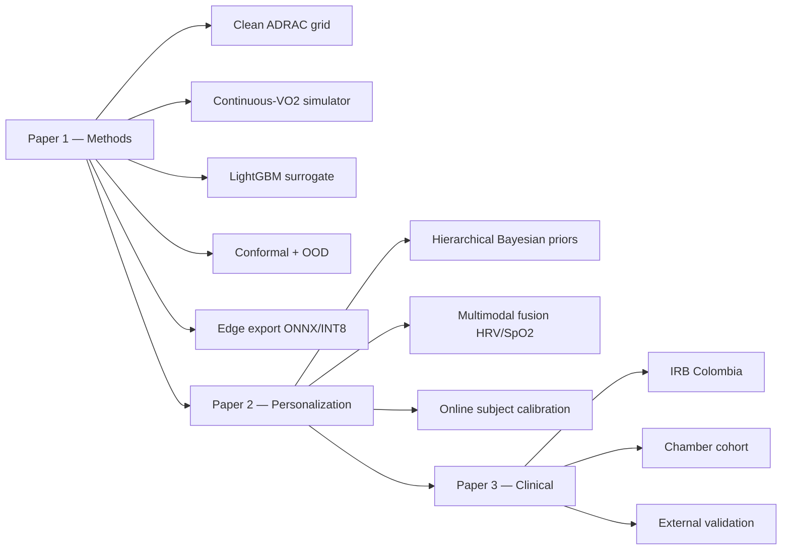

<div align="center">

# 🫁 TinyDCS

**A wearable-grade machine-learning stack for altitude-decompression-sickness risk prediction.**

*Hybrid physics + ML. Calibrated uncertainty. Edge-deployable. Operationally honest.*

<br>


[Scientific background](docs/scientific-background.md) ·
[Methods](docs/methods.md) ·
[Architecture](docs/architecture.md) ·
[Publication roadmap](docs/publication-roadmap.md) ·
[Changelog](CHANGELOG.md)

</div>

---

> ⚠️ **Research-only.** This repository is an experimental research artifact. It is not a clinical device, not a certified operational tool, and must not be used as the sole basis for any aeromedical decision. See `docs/scientific-background.md` for the published models this work extends and the validation envelope each inherits.

---

## What this is, in one paragraph

Existing altitude-DCS risk models trade off along a sharp axis: **ADRAC** (US Air Force, Pilmanis 2004) is closed-form and trivially portable but uses only three coarse exercise levels; **Conkin NASA-RM/NM** (2004) adds a physiologically-grounded Exercise Tissue Ratio but only during prebreathe; **Gerth 3RUT-MBe1** (NEDU TR 18-01, 2018) accepts arbitrary continuous VO₂(t) trajectories but is an ODE recursion too heavy for a smartwatch. TinyDCS is a *hybrid*: a small machine-learning surrogate trained on a cleaned ADRAC grid, with continuous VO₂ injected via Conkin's variable-half-time mechanism, finished with split-conformal prediction intervals and a principled out-of-envelope abstention mode. The model is designed to compile to INT8 ONNX (< 100 KB) and run in < 1 ms on an ARM Cortex-M4.

---

## Why this exists

Unpressurized general aviation above FL180 has a documented but under-monitored DCS risk (Stepanek et al., Mayo Clinic, 2024). Chamber training and EVA prebreathe protocols use ADRAC as a risk-planning tool on the ground, but there is no continuous on-body risk monitor during the exposure itself. Wearables now routinely stream accelerometer-derived VO₂ proxies, HR/HRV, SpO₂, and barometer altitude at multi-Hz rates — yet none of this telemetry is fed into a model that respects the published mechanistic priors. This repository is one attempt to close that gap, from first principles, with honest reporting of where it works and where it does not.

---

## Repository layout

```
DCS/
├── README.md                  ← you are here
├── CHANGELOG.md               ← versioned change log
├── LICENSE                    ← see notes
├── pyproject.toml             ← installable package
├── requirements.txt           ← pinned dependencies
│
├── mechanistic/               ← published physics-informed models (callable)
│   ├── rut_mbe1.py           ·   Gerth 3RUT-MBe1 (calibration reconciliation in progress)
│   ├── conkin_nasa.py        ·   Conkin RM/NM logistic (Eq 14/15, TP-2004-213158)
│   └── adrac.py              ·   closed-form ADRAC log-logistic AFT
│
├── tinydcs/                   ← the ML surrogate package
│   ├── simulator.py          ·   continuous-VO₂(t) wrapper around mechanistic models
│   ├── features.py           ·   13-feature vector for the surrogate
│   ├── surrogate.py          ·   LightGBM + split-conformal + Mahalanobis OOD
│   ├── metrics.py            ·   Brier, reliability, calibration slope/intercept
│   ├── data_clean.py         ·   cleaner for the shipped ADRAC CSV
│   └── cli.py                ·   console entry points
│
├── apps/                      ← user-facing applications
│   └── streamlit/app.py      ·   unified three-model explorer (ML / 3RUT / NASA)
│
├── scripts/                   ← reproducible pipeline runners
│   ├── 01_clean_data.py
│   ├── 02_simulate_training.py
│   └── 03_train_surrogate.py
│
├── tests/                     ← 14 passing tests; run with 'pytest'
├── docs/                      ← scientific background, methods, roadmap
├── data/                      ← small reference data products
├── artifacts/                 ← (git-ignored) model + metrics + figures
├── frontend/                  ← TypeScript visualization dashboard (existing)
└── legacy/                    ← historical iterations preserved for provenance
```

---

## Quick start

```bash
git clone https://github.com/strikerdlm/DCS
cd DCS
pip install -r requirements.txt          # or: pip install -e .

# Run the full pipeline end-to-end on the pilot configuration
python scripts/01_clean_data.py \
       --input legacy/Model_Rel_Candidate/DCS_Risk_DB_2025.csv \
       --output artifacts/DCS_Risk_DB_2025_clean.parquet \
       --report artifacts/data_quality_report.md

python scripts/02_simulate_training.py --n-profiles 200 --seed 42 \
       --output artifacts/training_pilot.parquet

python scripts/03_train_surrogate.py \
       --training artifacts/training_pilot.parquet \
       --test-fraction 0.2 --calibration-fraction 0.2 \
       --output-model artifacts/tinydcs_pilot.joblib \
       --output-metrics artifacts/metrics_pilot.json \
       --output-figures artifacts/figures_pilot

pytest tests/ -q
```

For a guided tour, the Streamlit app is available at `apps/streamlit/app.py`:

```bash
streamlit run apps/streamlit/app.py
```

---

## The three models, side by side

| Model | Paradigm | Continuous VO₂? | Edge-deployable? | Status in this repo |
|---|---|:---:|:---:|---|
| **ADRAC** (Pilmanis 2004) | Log-logistic AFT survival | ❌ (3-category) | ✅ | `mechanistic/adrac.py` (new, being fitted against the cleaned grid) |
| **Conkin RM/NM** (NASA 2004) | Logistic on Exercise Tissue Ratio | 🟡 (prebreathe only) | ✅ | `mechanistic/conkin_nasa.py` |
| **Gerth 3RUT-MBe1** (NEDU 2018) | Bubble-dynamics ODE | ✅ | ❌ | `mechanistic/rut_mbe1.py` ⚠️ [calibration reconciliation in progress](docs/methods.md#3rut-mbe1-reconciliation) |
| **TinyDCS** (this repo) | ML surrogate + conformal | ✅ | ✅ | `tinydcs/` — primary target pivoted to ADRAC (see docs/methods.md) |

---

## The plan, as a tree



See [`docs/publication-roadmap.md`](docs/publication-roadmap.md) for the full plan with journal targets, timelines, and dependencies.

---

## Status

| Milestone | Commit / tag | Status |
|---|---|---|
| Repo restructure (this commit series) | `main` @ v0.2.0 | ✅ |
| ADRAC cleaner (`tinydcs.data_clean`) | v0.1.0 | ✅ 1,221 rows rescaled, 15,908 unique cells |
| Continuous-VO₂ simulator + features | v0.1.0 | ✅ |
| LightGBM + conformal + OOD surrogate | v0.1.0 | ✅ end-to-end on 200-profile pilot |
| `mechanistic/adrac.py` closed-form AFT baseline | — | 🚧 next |
| Full simulation campaign (≥ 20,000 profiles) | — | 🚧 |
| 3RUT-MBe1 calibration reconciliation | — | 🚧 [tracking issue](docs/methods.md#3rut-mbe1-reconciliation) |
| ONNX/INT8 edge export | — | ⏳ Paper 1 scope |
| Hierarchical Bayesian personalization | — | ⏳ Paper 2 scope |
| Prospective Colombian chamber validation | — | ⏳ Paper 3 scope |

---

## Limitations & honest disclosures

- **Surrogate target ≠ clinical outcome.** The training target is a parametric model's output (ADRAC, optionally 3RUT-MBe1). Any claim beyond "reproduces the parametric model" requires prospective validation against observed DCS/VGE outcomes. That is explicitly Paper 3 scope.
- **3RUT-MBe1 implementation.** The vendored `mechanistic/rut_mbe1.py` currently under-reports P(DCS) by ~4–5 orders of magnitude relative to Gerth's Figure 16 on the five ADRAC-validation profiles. Reconciliation is ongoing (`docs/methods.md#3rut-mbe1-reconciliation`). Until resolved, TinyDCS primary target is ADRAC, not 3RUT-MBe1.
- **Dataset quality.** The shipped `DCS_Risk_DB_2025.csv` has documented scale inconsistencies (1,221 rows were mis-entered on the fraction scale instead of percent). `tinydcs.data_clean` repairs these deterministically; see `artifacts/data_quality_report.md` after running the cleaner.
- **Validity envelope.** All results apply strictly within the training-input envelope: altitude 18,000–40,000 ft; prebreathe 0–180 min; time-at-altitude 10–240 min; FiO₂ ∈ {0.21, 0.95, 1.0}. The surrogate's OOD detector abstains outside this envelope by design.
- **Individual variability.** None of the published models — or this surrogate — represent inter-subject differences in DCS susceptibility. This is a large known gap and the explicit subject of Paper 2.

---

## Citations (primary sources)

See `docs/scientific-background.md` for the full bibliography. The load-bearing citations are:

1. Kannan N, Raychaudhuri A, Pilmanis AA. *A loglogistic model for altitude decompression sickness.* **Aviat Space Environ Med** 1998; 69:965–70.
2. Pilmanis AA, Petropoulos L, Kannan N, Webb JT. *Decompression sickness risk model: development and validation by 150 prospective hypobaric exposures.* **Aviat Space Environ Med** 2004; 75:749–59.
3. Conkin J, Gernhardt ML. *A probability model of decompression sickness at 4.3 psia after exercise prebreathe.* **NASA TP-2004-213158**.
4. Webb JT, Krock LP, Gernhardt ML. *Oxygen consumption at altitude as a risk factor for altitude decompression sickness.* **Aviat Space Environ Med** 2010; 81:987–92.
5. Gerth WA et al. *A Probabilistic Model of Altitude Decompression Sickness Based on the 3RUT-MB Model.* **NEDU TR 18-01** (DTIC AD1101527), 2018.
6. Collins GS, Moons KGM, et al. *TRIPOD+AI statement.* **BMJ** 2024; 385:e078378.

---

## License

Research-use-only. All code is MIT-adjacent for research purposes; the vendored NASA/USAFSAM reference documents retain their original public-domain status.

## Citation for this repository

If you use any part of this work, please cite (format will stabilize at v1.0):

```bibtex
@software{tinydcs2026,
  author  = {Malpica, Diego},
  title   = {TinyDCS: a wearable-grade ML surrogate of altitude-DCS risk models},
  year    = {2026},
  url     = {https://github.com/strikerdlm/DCS},
  version = {0.2.0}
}
```
