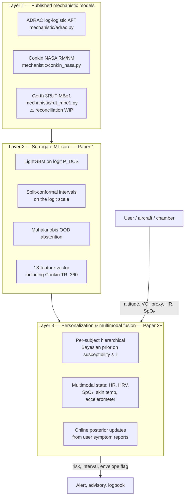
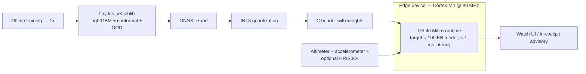

# Architecture

TinyDCS is designed around a **three-layer operational stack**: mechanistic priors at the bottom, a surrogate ML core in the middle, personalization + multimodal fusion on top. Only the bottom two layers exist today; the top layer is the explicit subject of Paper 2.

---

## 1. The three layers



**Data flow at inference time.**

1. The wearable + altitude source stream raw telemetry (altitude, accelerometer, HR, HRV, SpO₂, skin temperature).
2. Preprocessors compute the 13 surrogate features (most importantly: VO₂(t) from accelerometer + demographics; Conkin-style TR_360 from altitude + FiO₂ + PB time).
3. The **surrogate core** (L2) produces a population-average P(DCS) estimate with conformal interval and OOD flag.
4. The **personalization layer** (L3) modulates the L2 output via the subject's posterior susceptibility and multimodal state.
5. The decision layer emits an alert, an advisory, or a logbook entry depending on risk level and how the user has configured thresholds.

---

## 2. Code-level layout

```
mechanistic/                    ← Layer 1 (physics-informed models)
├── __init__.py                ·  re-exports the public API
├── rut_mbe1.py                ·  Gerth 3RUT-MBe1 (ODE recursion, Appendix C)
├── conkin_nasa.py             ·  Conkin RM/NM logistic
└── adrac.py                   ·  closed-form ADRAC log-logistic AFT [next]

tinydcs/                        ← Layer 2 (ML surrogate core)
├── __init__.py
├── simulator.py               ·  continuous-VO₂ wrapper around mechanistic/*
├── features.py                ·  13-feature extraction (including TR_360)
├── surrogate.py               ·  LightGBM + conformal + OOD bundle
├── metrics.py                 ·  Brier, reliability, Bland-Altman, coverage
├── data_clean.py              ·  ADRAC CSV scale-fix + dedup
└── cli.py                     ·  console entry points

apps/                           ← UIs
└── streamlit/app.py           ·  unified three-model explorer (existing)

scripts/                        ← reproducible runners
├── 01_clean_data.py
├── 02_simulate_training.py
└── 03_train_surrogate.py

tests/                          ← 14 passing tests; pytest tests/
```

The `frontend/` directory contains a separate TypeScript ECharts dashboard maintained as its own workstream; it is not load-bearing for TinyDCS's Python pipeline.

---

## 3. Dependency graph (Python packages)

```
mechanistic.rut_mbe1      ← no intra-repo deps
mechanistic.conkin_nasa   ← no intra-repo deps
mechanistic.adrac         ← no intra-repo deps [next]
mechanistic.__init__      ← re-exports above

tinydcs.simulator         ← depends on mechanistic.rut_mbe1
tinydcs.features          ← depends on tinydcs.simulator (for ExposureProfile)
tinydcs.data_clean        ← no intra-repo deps (pandas only)
tinydcs.metrics           ← sklearn only
tinydcs.surrogate         ← tinydcs.features (for FEATURE_COLUMNS)
tinydcs.cli               ← shells out to scripts/

scripts/01_clean_data.py          ← tinydcs.data_clean
scripts/02_simulate_training.py   ← tinydcs.simulator + tinydcs.features
scripts/03_train_surrogate.py     ← tinydcs.surrogate + tinydcs.metrics
```

No cycles. Every module can be tested in isolation.

---

## 4. Deployment view (Paper 1 target)



The training offline stage produces the joblib; an export step (`scripts/04_export_onnx.py`, not yet implemented) lowers it through ONNX → INT8 → a C header that can be compiled directly into firmware. The reference runtime (`tinydcs.runtime`, also not yet implemented) mirrors the quantized edge output bit-exactly, so Python developers can preview on-device behavior.

---

## 5. What's deliberately NOT in the architecture

- **No learned ensemble of the three mechanistic models.** Gerth (NEDU TR 18-01) already did the comparison; stacking them doesn't add orthogonal information. We use one as primary target (ADRAC after the pivot) and the others as comparators.
- **No neural network surrogate at Layer 2.** LightGBM is fast, well-calibrated on tabular data, and quantizes cleanly. A 2–3-layer MLP is an optional comparator in `pyproject.toml`'s `edge` extra, not the primary model.
- **No cloud dependency at inference.** The entire L1 + L2 stack runs on-device or on a phone. Layer 3's federated option (per-subject priors aggregated without centralizing raw data) is one of the possible privacy-preserving paths for Paper 2 but is not architecturally required.
- **No real-time streaming at Layer 2.** A prediction is computed at a user-configured cadence (e.g., every 30 seconds) rather than continuously. The state update is stateless over features, so the cadence is a deployment choice not an architectural constraint.
